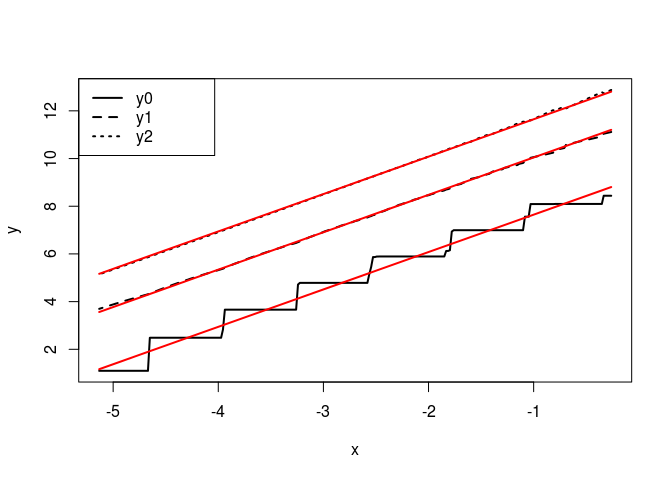
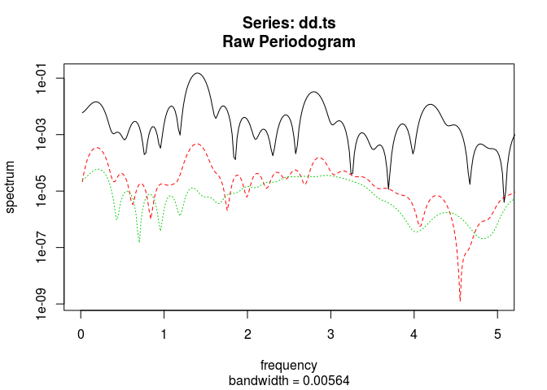

<!-- Edit README.Rmd instead of README.md -->
Estimating Fractal Curvature
============================

This page illustrates the computations from the paper [Estimation of fractal dimension and fractal curvatures from digital images](http://arxiv.org/abs/1408.6333) (Spodarev, E., Straka, P., & Winter, S. (2015))

Fractal Dimension
-----------------

Conventionally, the dimension of a fractal *F* estimated via the *box counting method*

dim(*F*)=lim<sub>*ϵ* ↓ 0</sub>log*N*<sub>*ϵ*</sub>/( − log(*ϵ*))

where *N*<sub>*ϵ*</sub> is the number of blocks on a grid with resolution *ϵ* which intersect with *F*, or with the "sausage method"

dim(*F*)=*d* − lim<sub>*ϵ* ↓ 0</sub>log*C*<sub>*d*</sub>(*F*<sub>*ϵ*</sub>))/log(*ϵ*)

where *F*<sub>*ϵ*</sub> denotes the "parallel set" of all points whose distance from *F* is no greater than *ϵ*, and *C*<sub>*d*</sub> denotes the *d*-dimensional volume (Lebesgue measure).

Novel approach
--------------

This paper utilizes **all** *d* + 1 intrinsic volumes for the estimation of fractal dimension, and also estimates the scaling limits of these intrinsic volumes, called the **Fractal Curvatures**.

In two dimensions, the intrinsic volumes correspond to surface *C*<sub>2</sub>, (half) boundary length *C*<sub>1</sub> and euler characteristic *C*<sub>0</sub> (i.e. number of connected components minus number of holes). The paper uses the following result by [Winter (2007)](http://www.math.kit.edu/iag4/~winter/media/dissmath629.pdf):

> The intrinsic volumes *C*<sub>*k*</sub>(*F*<sub>*ϵ*</sub>) of the parallel sets scale with *ϵ*<sup>*k* − *s*</sup>, where *s* = dim(*F*)∈(0, 2) is the fractal dimension and *k* = 2, 1, 0 is the index of the intrinsic volume.

Transformed logarithmically, the estimation of dim(*F*) and the fractal curvatures then becomes a multivariate regression problem, s. below.

The Data
--------

After loading the workspace `fracCurv.RData` (see main directory) in RStudio, the data frames for the six fractal images (gasket, carpet, modcarpet, quadrate, triangle, supergasket) become available. Each data frame contains 4 variables:

-   *x* = −log*ϵ*
-   *y*<sub>0</sub> = log*C*<sub>0</sub>(*F*<sub>*ϵ*</sub>)
-   *y*<sub>1</sub> = log\[*C*<sub>1</sub>(*F*<sub>*ϵ*</sub>)/*ϵ*\]
-   *y*<sub>2</sub> = log\[*C*<sub>2</sub>(*F*<sub>*ϵ*</sub>)/*ϵ*<sup>2</sup>\]

The "independent variable" *x* was chosen on a uniform grid, and the "dependent variables" *y*<sub>0</sub>, *y*<sub>1</sub>, *y*<sub>2</sub> were measured using the Java library [GeoStoch](https://www.uni-ulm.de/en/mawi/institute-of-stochastics/overview/software/). This was done for images with resolutions 3000 x 3000 (folder 3000) and 1500 x 1500 (folder 1500; a trailing number `2` in the workspace denotes the lower resolution).

Fitting the model
-----------------

The R-files [fracCurv.R](./fracCurv.R) and [periodogram.R](./periodogram.R) contain the R-code for the fits.

Self-similar fractals come in two varieties: arithmetic and non-arithmetic. In the arithmetic case, all similarities are rational and have a common divisor (e.g. Sierpinski gasket & carpet, and modcarpet). The rescaled intrinsic volumes then oscillate around their (asymptotic) mean values (= the fractal curvatures). In the non-arithmetic case (quadrate, triangle, supergasket), the oscillations eventually die out.

### Non-arithmetic fits

Non-arithmetic fits assume fits with straight lines; LRE (linear regression estimate) is called as follows:

``` r
fracCurv(gasket,arithmetic = FALSE)
```

This results in a linear fit to the data (*y*<sub>0</sub>, *y*<sub>1</sub>, *y*<sub>2</sub>). The output contains estimated fractal dimension, curvatures and fitted linear model.



    ## $frac.dim
    ## [1] 1.568276
    ## 
    ## $frac.curv
    ##        y0        y1        y2 
    ##  10066.55 110747.20 549582.87 
    ## 
    ## $period
    ## [1] NA
    ## 
    ## $fit
    ## 
    ## Call:
    ## lm(formula = fml, data = data)
    ## 
    ## Coefficients:
    ## (Intercept)          ky1          ky2            x  
    ##       9.217        2.398        4.000        1.568

### Arithmetic fits

In the arithmetic case, the frequency of the oscillations is estimated with a periodogram, and the fit uses a linear line plus 4 Fourier terms (sines and cosines). Compare the above to the method NRE (nonlinear regression estimate):

``` r
fracCurv(gasket,arithmetic = TRUE)
```

Here the period is estimated via a periodogram of the data:

 

    ## $frac.dim
    ## [1] 1.567955
    ## 
    ## $frac.curv
    ##        y0        y1        y2 
    ##  10482.48 110686.53 549127.93 
    ## 
    ## $period
    ## [1] 0.7109927
    ## 
    ## $fit
    ## 
    ## Call:
    ## lm(formula = fml, data = data)
    ## 
    ## Coefficients:
    ##             (Intercept)                      ky1                      ky2  
    ##               9.2215596                2.3926616                3.9945070  
    ##                       x          ky0:cos(mu * x)          ky1:cos(mu * x)  
    ##               1.5679550               -0.0816219                0.0269537  
    ##         ky2:cos(mu * x)      ky0:I(-sin(mu * x))      ky1:I(-sin(mu * x))  
    ##              -0.0069345                0.3329398                0.0114771  
    ##     ky2:I(-sin(mu * x))      ky0:cos(2 * mu * x)      ky1:cos(2 * mu * x)  
    ##               0.0009408                0.0670478               -0.0033627  
    ##     ky2:cos(2 * mu * x)  ky0:I(-sin(2 * mu * x))  ky1:I(-sin(2 * mu * x))  
    ##               0.0014596               -0.1247953               -0.0070124  
    ## ky2:I(-sin(2 * mu * x))      ky0:cos(3 * mu * x)      ky1:cos(3 * mu * x)  
    ##               0.0048767               -0.0617118               -0.0012906  
    ##     ky2:cos(3 * mu * x)  ky0:I(-sin(3 * mu * x))  ky1:I(-sin(3 * mu * x))  
    ##               0.0004809                0.0390005                0.0024701  
    ## ky2:I(-sin(3 * mu * x))      ky0:cos(4 * mu * x)      ky1:cos(4 * mu * x)  
    ##               0.0000616                0.0590217               -0.0007790  
    ##     ky2:cos(4 * mu * x)  ky0:I(-sin(4 * mu * x))  ky1:I(-sin(4 * mu * x))  
    ##               0.0003795               -0.0035249               -0.0046942  
    ## ky2:I(-sin(4 * mu * x))  
    ##               0.0022762

### Fits with known dimension

Assuming the dimension is known, a fit is performed e.g. as

``` r
fracCurv(gasket[,c(1,2)],arithmetic = FALSE, frac.dim = log(3)/log(2))
```

Note that only one characteristic can be fitted at a time, here for *k* = 0. If dimension and period are known (for *arithmetic* fractals) one calls e.g.

``` r
fracCurv(gasket[,c(1,2)],arithmetic = TRUE, frac.dim = log(3)/log(2), period = log(2))
```
