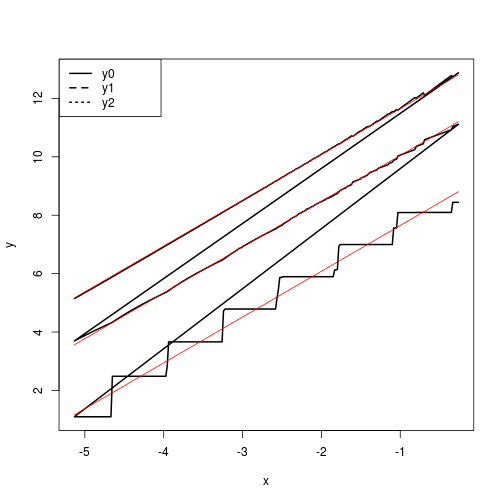
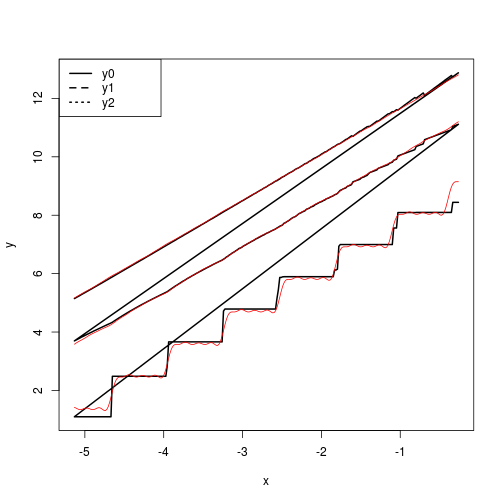

This page illustrates calculations from the paper [Estimation of fractal dimension and fractal curvatures from digital images](http://arxiv.org/abs/1408.6333). 
After loading the workspace [fracCurv.RData](./fracCurv.Rdata), the data sets for the six fractal sets (gasket, carpet, modcarpet, quadrate, triangle, supergasket) become available. 
These were calculated using the Java library [GeoStoch](http://www.uni-ulm.de/en/mawi/institute-of-stochastics/software.html); see [here](./?) for the main method. 
The images have resolution $3000 \times 3000$, or $1500 \times 1500$ if the number `2` appears in the data set name.


### Non-arithmetic fits

The method LRE (linear regression estimate) is called as follows: 


```r
fracCurv(gasket,arithmetic = FALSE)
```

This results in a linear fit to the data 
$y_{kj}  := \log \left( \varepsilon_j^{-k} |C_k(F_{\varepsilon_j})|\right), \quad k=0,\ldots, d$. The output contains estimated fractal dimension, curvatures and fitted linear model.

 

```
## $frac.dim
## [1] 1.568276
## 
## $frac.curv
##        y0        y1        y2 
##  10066.55 110747.20 549582.87 
## 
## $period
## [1] NA
## 
## $fit
## 
## Call:
## lm(formula = fml, data = data)
## 
## Coefficients:
## (Intercept)          ky1          ky2            x  
##       9.217        2.398        4.000        1.568
```

### Arithmetic fits

Compare the above to the method NRE (nonlinear regression estimate): 


```r
fracCurv(gasket,arithmetic = TRUE)
```

Here the period is estimated via a periodogram of the data: 

  

```
## $frac.dim
## [1] 1.567955
## 
## $frac.curv
##        y0        y1        y2 
##  10482.48 110686.53 549127.93 
## 
## $period
## [1] 0.7109927
## 
## $fit
## 
## Call:
## lm(formula = fml, data = data)
## 
## Coefficients:
##             (Intercept)                      ky1                      ky2  
##               9.2215596                2.3926616                3.9945070  
##                       x          ky0:cos(mu * x)          ky1:cos(mu * x)  
##               1.5679550               -0.0816219                0.0269537  
##         ky2:cos(mu * x)      ky0:I(-sin(mu * x))      ky1:I(-sin(mu * x))  
##              -0.0069345                0.3329398                0.0114771  
##     ky2:I(-sin(mu * x))      ky0:cos(2 * mu * x)      ky1:cos(2 * mu * x)  
##               0.0009408                0.0670478               -0.0033627  
##     ky2:cos(2 * mu * x)  ky0:I(-sin(2 * mu * x))  ky1:I(-sin(2 * mu * x))  
##               0.0014596               -0.1247953               -0.0070124  
## ky2:I(-sin(2 * mu * x))      ky0:cos(3 * mu * x)      ky1:cos(3 * mu * x)  
##               0.0048767               -0.0617118               -0.0012906  
##     ky2:cos(3 * mu * x)  ky0:I(-sin(3 * mu * x))  ky1:I(-sin(3 * mu * x))  
##               0.0004809                0.0390005                0.0024701  
## ky2:I(-sin(3 * mu * x))      ky0:cos(4 * mu * x)      ky1:cos(4 * mu * x)  
##               0.0000616                0.0590217               -0.0007790  
##     ky2:cos(4 * mu * x)  ky0:I(-sin(4 * mu * x))  ky1:I(-sin(4 * mu * x))  
##               0.0003795               -0.0035249               -0.0046942  
## ky2:I(-sin(4 * mu * x))  
##               0.0022762
```


### Fits with known dimension

Assuming the dimension is known, a fit is performed e.g. as 


```r
fracCurv(gasket[,c(1,2)],arithmetic = FALSE, frac.dim = log(3)/log(2))
```

Note that only one characteristic can be fitted at a time, here for $k = 0$. 
If dimension and period are known (for _arithmetic_ fractals) one calls e.g.


```r
fracCurv(gasket[,c(1,2)],arithmetic = TRUE, frac.dim = log(3)/log(2), period = log(2))
```

